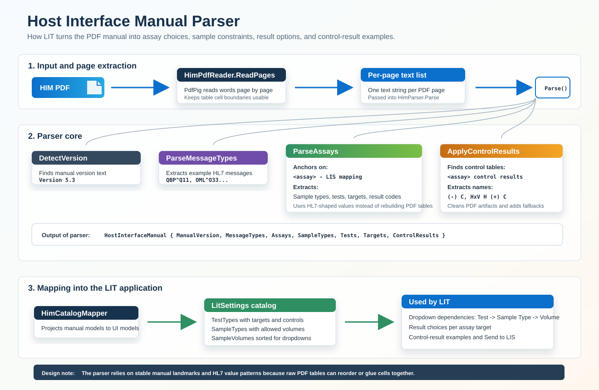
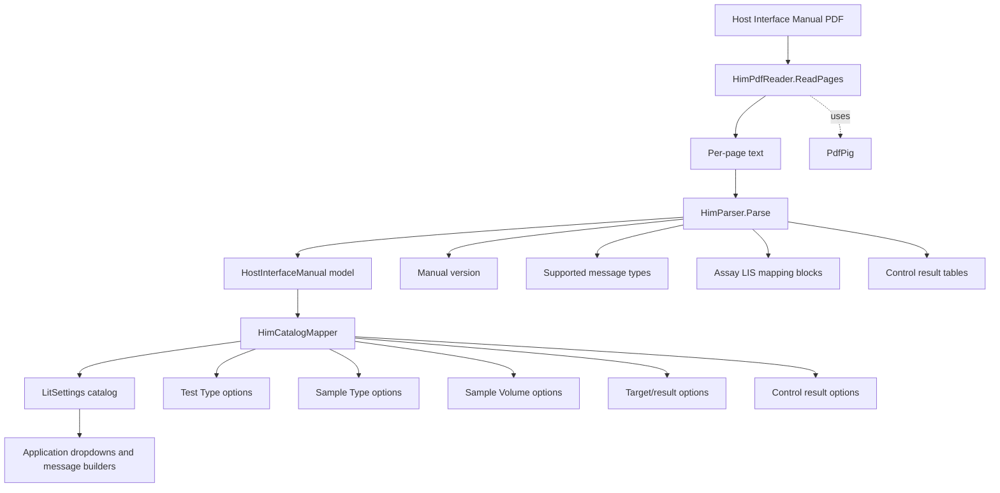

# Host Interface Manual Parser

This document shows how LIT reads the Host Interface Manual PDF and turns it
into the assay/test catalog used by the application.

## Visual Overview



## High-Level Flow



## Detailed Parser Logic

```mermaid
flowchart LR
    subgraph Input["Input"]
        PDF[HIMv2_1.pdf or imported PDF]
        DEF[HIMdefinitions_###.txt]
    end

    PDF --> ReadPdf[HimPdfReader.ReadPages]
    ReadPdf --> Pages[Page text list]
    DEF --> LoadDefs[HimDefinitionsStore.Load]

    Pages --> Parse[HimParser.Parse]
    LoadDefs --> Manual[HostInterfaceManual]
    Parse --> Manual

    subgraph ParseSteps["HimParser.Parse"]
        Version[DetectVersion]
        MsgTypes[ParseMessageTypes]
        Assays[ParseAssays]
        Controls[ApplyControlResults]
    end

    Parse --> Version
    Parse --> MsgTypes
    Parse --> Assays
    Parse --> Controls

    subgraph AssayBlock["For each '<assay> - LIS mapping' block"]
        Heading[Find real assay heading]
        Samples[ParseSampleTypes<br/>TCD-9-1 and SPM-4]
        Tests[ParseTests<br/>OBR-4 / TCD-1]
        Targets[ParseTargets<br/>OBX-3]
        Results[ApplyResultCodes<br/>OBX-5 and OBX-8-1]
    end

    Assays --> Heading
    Heading --> Samples
    Heading --> Tests
    Heading --> Targets
    Heading --> Results

    subgraph ControlBlock["For each assay control table"]
        Caption[Find '<assay> control results']
        Slice[Slice table region]
        Extract[Extract names like<br/>'(-) C', 'HxV H (+) C']
        Clean[Clean PDF text artifacts]
        Fallback[Ensure at least one positive<br/>and one negative control]
    end

    Controls --> Caption
    Caption --> Slice
    Slice --> Extract
    Extract --> Clean
    Clean --> Fallback

    Manual --> Map[HimCatalogMapper]
    Map --> TestTypes[TestType list]
    Map --> SampleTypes[SampleType list]
    Map --> Volumes[SampleVolume list]

    TestTypes --> UI[Test Type dropdown]
    SampleTypes --> UI2[Sample Type dropdown]
    Volumes --> UI3[Sample Volume dropdown]
    TestTypes --> Generator[Example Generator]
    TestTypes --> Sender[Send Results to LIS]
```

## What The Parser Extracts

| Manual area | Parser output | Used by |
| --- | --- | --- |
| Manual version line | `HostInterfaceManual.ManualVersion` | Import summary/settings |
| HL7 example messages | `HimMessageType` entries | Supported workflow metadata |
| `Sample types and input volume` | `AssaySampleType` entries | Sample Type and Sample Volume dropdowns |
| `Tests` table | `AssayTest` entries | Test Type dropdown and OBR-4/TCD-1 |
| `Targets` table | `AssayTarget` entries | OBX-3 targets |
| `Sample result codes for OBX segment` | OBX-5 choices and OBX-8 interpretations | Result dropdowns |
| `Control results` table | `AssayControlResult` entries | Control-result generator and sender |

## Important Design Choice

The parser does not try to rebuild the PDF tables cell-by-cell. The PDF text
extraction can reorder columns or glue adjacent cells together. Instead, LIT
anchors on stable manual landmarks, then extracts HL7-shaped values:

- `<assay> - LIS mapping`
- `(TCD-9-1)`
- `(OBR-4 / TCD-1)`
- `(OBX-3)`
- `(OBX-5)` and `(OBX-8-1)`
- `<assay> control results`
- HL7 coded values such as `PLAS^plasma^HL70487`, `70241-5^HIV^LN`, and
  `HIV^HIV^99ROC`

This makes the import more tolerant of PDF formatting artifacts while still
keeping the catalog tied to the Host Interface Manual.
